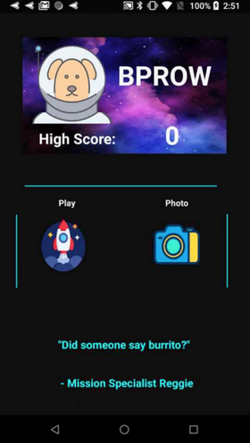
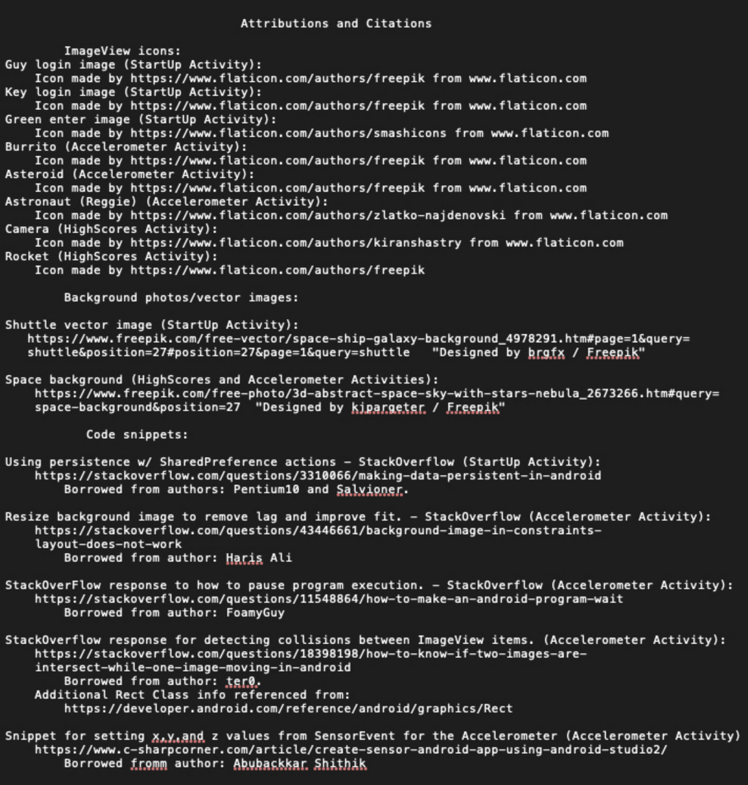

# "Reggie Goes Interstellar"  
## Final Project - CS3013 - Fall 2019
#### Reggie (player) avoids collisions with enemies (asteroids & satellites) as they move across the screen. Collisions with Burritos slow enemy frequency. Time based game, the longer Reggie avoids enemies the higher the score.  

#### Elements applied:  
* Accelerometer sensor for game play.
* User creds. & high score persistent (Score not saved currently).
* Functionality for user to access device camera to customize their account.

## **Login screen**  

  

## **User main screen after login**  

  
  

## References:

  
