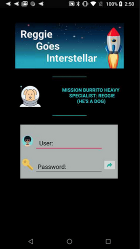

# "Reggie Goes Interstellar"  
## Final Project - CS3013 - Fall 2019
#### Reggie (player) avoids collisions with enemies (asteroids & satellites). Collisions with Burritos slow enemy frequency. Time based game, the longer Reggie avoids enemies the higher the score.  

#### Android Elements  
* Accelerometer sensor  
* User login, high score persistent w/ SharedPrefence.  

## **Login screen**  

  

## **User high score screen grab**  

  
  

## References:

  
